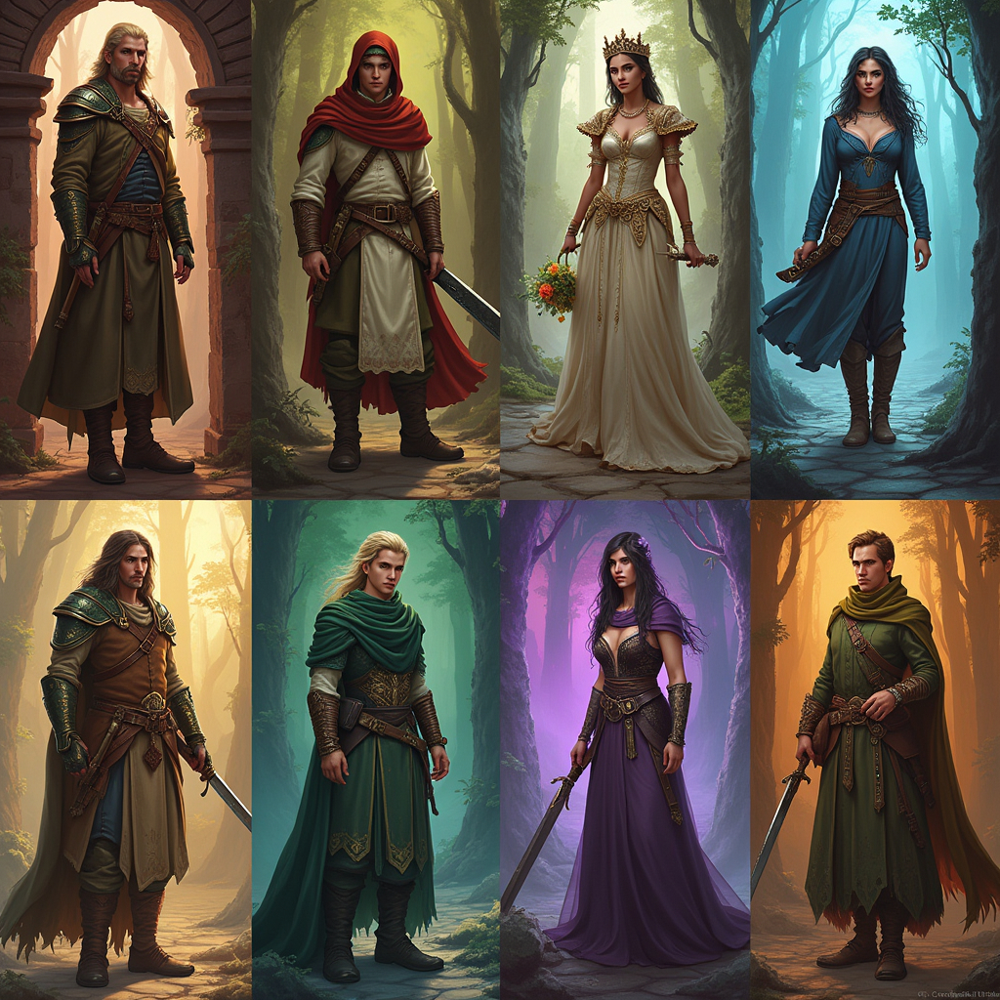
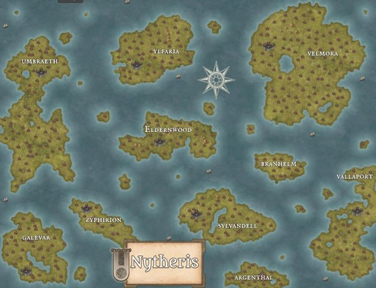

# Il Mercato delle Ombre – Pacta Sunt Servanda

**Campagna D&D**

**Autore:** E.W. Darkhel

## Introduzione

*Il Mercato di Lea: Un luogo fuori dal tempo*

Quattrocento anni fa, l'umanità ha annientato la magia. O almeno così si raccontano gli umani. Nel mondo governato dal ferro e dalla religione, la magia è ormai solo una leggenda sussurrata nei vicoli e temuta nelle corti.

Ma ogni mese, per un solo giorno, il Mercato delle Ombre appare dal nulla. Nessuno sa come trovarlo, ma tutti sanno cosa lei vende: tempo, emozioni, ricordi e frammenti d'anima. Qui, uomini e donne disperati barattano la loro felicità per qualche ora in più, generali in declino scambiano i ricordi della loro giovinezza per la forza di combattere e sovrani corrotti pagano con l'amore dei loro cari in cambio di più potere.

Lea Vhassir è l'ultima maga sopravvissuta al massacro della sua gente. Fredda ed enigmatica, ha dedicato secoli alla vendetta, assorbendo vita e potere dagli umani. La sua magia cresce con ogni scambio.

Ma poi, una notte, un uomo entra nel Mercato con un'offerta che nessuno ha mai fatto prima. Non cerca giovinezza né potere. Non vuole né denaro né amore. Vuole vendere un segreto per riportare in vita il suo amore perduto. Una verità così pericolosa che potrebbe distruggere tutto ciò per cui il Mercante ha pianificato. E se l'unica cosa capace di fermarla fosse proprio la verità che ha passato secoli a cercare?

Nessuno conosce la vera origine del Mercato di Lea. Alcuni dicono che sia una maledizione, un frammento del mondo antico che si rifiuta di svanire. Qualunque sia la verità, il Mercato esiste. E chiunque voglia qualcosa – a qualsiasi prezzo – prima o poi ne sentirà il richiamo.

## Creazione del Personaggio

### Regole Generali
- Tutti i personaggi sono umani.
- Le capacità derivano dall’esperienza, non dalla magia.
- Non tutti i personaggi devono essere moralmente buoni.

### Passato e Motivazioni
Motivazioni comuni includono:
- Un familiare malato
- Un amore perduto
- Vendetta
- Potere
- Redenzione
- Fuga

### Background & Archetipi
Archetipi come:
- Il Cacciatore di Reliquie
- La Guardia Reale
- La Principessa
- Il Fuggitivo
- Il Nobile Caduto
- Il Mistico
- Il Mercenario
- L’Erborista o Guaritore

### Competenze e Regole Speciali
- Ogni personaggio sceglie due competenze tra: Percezione, Sopravvivenza, Inganno, Persuasione, Furtività, Investigazione, Atletica, e Medicina.
- Ogni personaggio inizia con un oggetto significativo legato al proprio passato.

### Equipaggiamento di Partenza
- Equipaggiamento limitato basato sul background del personaggio.

## Il Mercato Errante
**Comparsa:** Appare una volta al mese, per un unico giorno.

**Regole d’Accesso:**
- Non si può entrare senza un’offerta.
- Non si può mentire a Lea.
- Non si può rubare dal Mercato.
- Gli accordi sono vincolanti.
- Il tempo nel Mercato non segue le leggi mortali.

## Le Regole del Baratto
**Tipi di Scambio:**
- Tempo di vita
- Emozioni e sentimenti
- Ricordi e identità
- Legami e giuramenti

**Conseguenze:** Ogni scambio ha conseguenze, spesso negative.

## Fazioni e Nemici del Mercato
**Principali Fazioni:**
- Il Consiglio Nero
- La Chiesa della Cenere
- I Senza Volto
- Gli Spettri del Mercato
- L’Ordine della Fiamma Pura
- Il Sindacato delle Lame Nere
- Il Conclave degli Antichi

## Bestiario del Mercato
**Creature:**
- L’Accolito del Debito
- I Ratti
- L’Artigiano delle Lacrime
- Il Cantastorie
- I Guardiani della Soglia
- I Custodi Silenti
- Il Collezionista
- Il Venditore Senza Bocca
- La Bambola del Dolore
- Il Cacciatore di Debitori
- Il Sussurratore di Offerte
- La Bestia della Bilancia

## Le Regole delle Maledizioni
**Principi Fondamentali:**
- Legate a un baratto o a un accordo infranto.
- Personalizzate per la vittima.
- Non possono essere rimosse con incantesimi comuni.
- Peggiorano nel tempo.
- Possono essere spezzate solo con un sacrificio equivalente.

## Archi Narrativi e Struttura delle Sessioni
**Struttura di una Sessione Base:**
- Il Richiamo del Mercato
- L’Esplorazione
- Il Baratto
- Le Conseguenze

**Archi Narrativi:**
- Il Debito di Sangue
- Il Mercato Invisibile
- Il Desiderio Maledetto
- La Caccia al Mercante

## Dadi Richiesti
- D9
- D20

## Mappa
