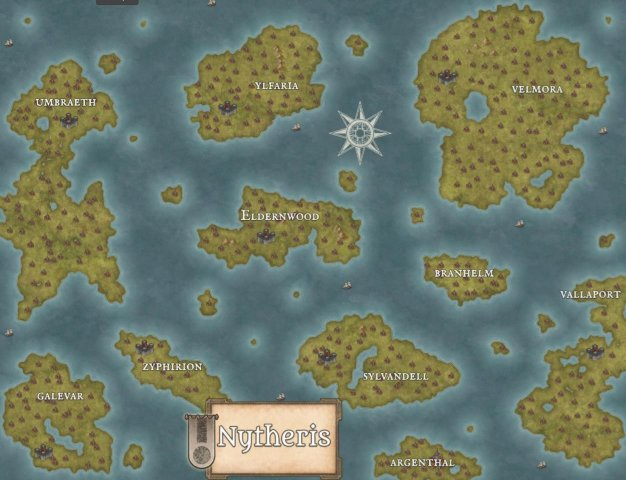

**IL MERCATO DELLE OMBRE – PACTA SUNT SERVANDA** 

**Campagna D&D**  

**E.W. Darkhel** 

**Mappa** 

 

**INTRODUZIONE** 

*Il Mercato di Lea: Un luogo fuori dal tempo* 

Quattrocento anni fa, l'umanità ha annientato la magia. 

O almeno così si raccontano gli umani. 

Nel mondo governato dal ferro e dalla religione, la magia è ormai solo una leggenda sussurrata nei vicoli e temuta nelle corti.  

Ma ogni mese, per un solo giorno, il Mercato delle ombre appare dal nulla.  

Nessuno sa come trovarlo, ma tutti sanno cosa lei vende: tempo, emozioni, ricordi e frammenti d'anima. Qui, uomini e donne disperati barattano la loro felicità per qualche ora in più, generali in declino scambiano i ricordi della loro giovinezza per la forza di combattere e sovrani corrotti pagano con l'amore dei loro cari in cambio di più potere. 

Lea Vhassir è l'ultima maga sopravvissuta al massacro della sua gente. Fredda ed enigmatica, ha dedicato secoli alla vendetta, assorbendo vita e potere dagli umani.  

La sua magia cresce con ogni scambio. 

Ma poi, una notte, un uomo entra nel Mercato con un'offerta che nessuno ha mai fatto prima.  Non cerca giovinezza né potere. Non vuole né denaro né amore. 

Vuole vendere un segreto per riportare in vita il suo amore perduto. 

Una verità così pericolosa che potrebbe distruggere tutto ciò per cui il Mercante ha pianificato. 

E se l'unica cosa capace di fermarla fosse proprio la verità che ha passato secoli a cercare? 

Nessuno conosce la vera origine del Mercato di Lea. Alcuni dicono che sia una maledizione, un frammento del mondo antico che si rifiuta di svanire. Qualunque sia la verità, il Mercato esiste. E chiunque voglia qualcosa – a qualsiasi prezzo – prima o poi ne sentirà il richiamo. 

Appare solo un giorno una volta al mese, quando la luna è più alta nel cielo e le ombre si allungano nel vento. Non si sa dove sarà la prossima volta: un villaggio dimenticato, una rovina infestata, una città già condannata al suo destino. Solo coloro che hanno qualcosa da offrire – un ricordo, un battito di cuore, un pezzo di anima – possono vederne i tendoni, respirarne l’aria satura di incenso e magia. 

Al centro di tutto c’è **Lea**, l’ultima maga del mondo. Nei suoi occhi senza tempo brucia un odio antico, un dolore che non si placa. Gli umani hanno sterminato la sua specie, temendo il potere che non potevano controllare. Ora, lei è rimasta l’unica, e il Mercato è il suo strumento di vendetta. 

Se vuoi entrare, preparati a pagare il prezzo. Qui non si accettano monete d’oro o argento. Qui si scambiano **emozioni, ricordi, anni di vita**. Qui si può ottenere ciò che nessuna magia o dio può concedere – **ma nulla è mai senza conseguenze**. 

Il Mercato di Lea è un luogo di **opportunità e disperazione**, di **speranze e condanne**. I personaggi che vi metteranno piede dovranno scegliere con saggezza. Perché una volta dentro, non c’è garanzia di uscirne interi. 

**Dadi richiesti**  

D9 D20 

**CAPITOLO 1: CREAZIONE DEL PERSONAGGIO** 

*Il Mercato di Lea non è un luogo per eroi.*  

*Chi vi entra non lo fa per gloria o per nobiltà d’animo, ma perché ha bisogno di qualcosa. Forse disperazione, forse avidità, forse un’ombra del passato che non lascia scampo.*  

*Qui i personaggi non sono predestinati a salvare il mondo, ma a sopravvivere alle conseguenze delle loro scelte.* 

1. **Regole Generali per i Personaggi** 
- **Tutti i personaggi sono umani.** Nessuno possiede poteri innati o abilità straordinarie. 
- **Lea è l’unica eccezione, essendo** l’ultima maga del mondo e gestisce il Mercato. 
- **Le capacità dei personaggi derivano dall’esperienza, non dalla magia.** Tuttavia, il Mercato offre opportunità per chi è disposto a pagarne il prezzo… 
- **Non  tutti  i  personaggi  devono  essere  moralmente  buoni.**  I  loro  scopi  possono  essere egoistici o oscuri.  
2. **Passato e Motivazioni** 

Ogni personaggio deve avere un motivo per cercare il Mercato.  Di seguito alcune possibilità: 

` `**Motivazioni Comuni** 

- **Un familiare malato**: Serve una cura che nessun medico può fornire. 
- **Un amore perduto**: Riportare in vita qualcuno, o riaverlo indietro in altro modo. 
- **Vendetta**: Si cerca un mezzo per punire qualcuno che ha rovinato la propria vita. 
- **Potere**: Ambizione, desiderio di ricchezza o di dominio sugli altri. 
- **Redenzione**: Cancellare un peccato passato, o liberarsi da una maledizione. 
- **Fuga**: Si cerca di sfuggire a un destino segnato. 

**Chi li aspetta fuori dal mercato?** 

- **Una famiglia.** 
- **Un nemico.** 
- **Un debito da pagare nel mondo reale.** 
- **Altro...** 

￿ 

3. **Background & Archetipi di Personaggi** 

Sebbene siano tutti umani, i personaggi possono rientrare in archetipi specifici basati sulle loro abilità e sul loro passato. 

` `**Il Cacciatore di Reliquie** 

- Esperto di leggende, sa dove trovare oggetti proibiti. 
- Riconoscere oggetti magici, venduti al Mercato 

` `**La guardia reale** 

- Protegge la famiglia reale 
- Vuole accrescere il proprio potere. 

**La principessa** 

- È ricca e viziata. 
- Vuole trovare marito. 

**Il Fuggitivo** 

- Ha un passato oscuro, braccato da qualcuno. 
- Può avere esperienza di furti, spionaggio o omicidio. 
- Ha un’abilità speciale per nascondersi o mescolarsi alla folla. 

**Il Nobile Caduto** 

- Un tempo potente, ora in rovina. 
- Può avere risorse o alleati influenti, ma anche nemici pericolosi. 
- Cerca il Mercato per riconquistare il proprio status. 

**Il Mistico**  

- Crede in forze oscure e proibite. 
- Ha studiato il Mercato per anni, e sa più di quanto dovrebbe. 
- È disposto a tutto per ottenere il potere che gli è stato negato. 

**Il Mercenario** 

- Vende la propria spada, ma il Mercato potrebbe offrirgli qualcosa di più. 
- Ha esperienza nei combattimenti, ma non crede nella magia… almeno all’inizio. 

` `**L’Erborista o Guaritore** 

- Conosce rimedi naturali, ma si è scontrato con un male incurabile. 
- Il Mercato è l’ultima speranza per una cura che la scienza non può dare. 
4. **Competenze e Regole Speciali** 
- Ogni personaggio sceglie **due competenze** tra: 
  - Percezione 
  - Sopravvivenza 
  - Inganno 
  - Persuasione 
  - Furtività 
  - Investigazione 
  - Atletica 
  - Medicina 
- **Ogni personaggio inizia con un oggetto significativo** legato al proprio passato (es. un anello di famiglia, una lettera incompiuta, un’arma usata in un crimine). 
5. **Equipaggiamento di Partenza** 

In base al background, i personaggi iniziano con un equipaggiamento limitato, adatto al loro ruolo.  **Esempio di equipaggiamento iniziale**: 

- **Il Cacciatore di Reliquie**: Diario con mappe antiche, una torcia, un pugnale. 
- **La guardia reale:** Spada, armatura 
- **Principessa:** Soldi, vestiti eleganti 
- **Il Fuggitivo**: Mantello con cappuccio, pugnale nascosto, una borsa con monete rubate. 
- **Il Nobile Caduto**: Vestiti logori ma nobili, un sigillo di famiglia, una lettera da un alleato. 
- **Il Mistico**: Un libro proibito, una candela, una pergamena incompleta. 
6. **Città/isole Esistenti** 

**Velmora:** è una potenza marittima e il centro politico più influente della regione. Sorge su una costa frastagliata, con il suo grande porto che accoglie mercanti da ogni angolo del mondo. Il 

Palazzo della Regina domina la città dall’alto di una scogliera, un’imponente fortezza che simboleggia la grandezza e la resilienza del regno. 

La sua alleanza con **Branhelm** è indissolubile: la regina di Velmora e il re di Branhelm sono fratelli, e i due regni si sostengono militarmente ed economicamente. Tuttavia, Velmora è in guerra con **Galevar**, un conflitto che sta svuotando le casse e minando la stabilità interna. 

Molti abitanti sussurrano del Mercato di Lea, alcuni lo cercano disperatamente, altri temono le sue promesse. Velmora è una città dove chiunque può trovare qualcosa… se è disposto a pagare il prezzo giusto. 

**Caratteristiche:** 

- Centro del commercio e della politica 
- Flotta potente, ma in difficoltà a causa della guerra 
- Gente pragmatica, aperta agli affari e ai segreti 

**Branhelm:** è una città-fortezza costruita tra le montagne, circondata da mura imponenti e torri di guardia. Qui risiede una delle armate più temute del continente, addestrata sin dall’infanzia 

nell’arte della guerra. A differenza di Velmora, che prospera con il commercio, Branhelm si è sempre affidata alla sua forza militare per mantenere il proprio potere. 

Essendo alleata di Velmora, fornisce truppe per la guerra contro Galevar, ma alcuni all’interno della corte reale iniziano a chiedersi se valga la pena continuare a sacrificare uomini e risorse per un conflitto che potrebbe non avere mai fine. 

Il Mercato di Lea è visto con sospetto qui. I guerrieri di Branhelm credono nel sudore e nel sangue, non nelle scorciatoie magiche. Eppure, si dice che alcuni nobili abbiano già ceduto qualcosa nel Mercato per assicurarsi la vittoria… 

**Caratteristiche:** 

- Città-fortezza con una delle migliori armate del continente 
- Cultura della disciplina e dell’onore 
- Relazioni tese con alcuni nobili di Velmora a causa della guerra 

**Vallaport:** è la città dove tutto si compra e tutto si vende. Situata su un’isola strategica lungo le principali rotte commerciali, funge da porto franco per mercanti, contrabbandieri e ambasciatori. 

Qui non ci sono re o regine, ma un concilio di ricchi mercanti che governano la città come una corporazione. 

A Vallaport, il Mercato di Lea è più di una leggenda: è una realtà accettata. Molti hanno visto il Mercato comparire nei vicoli più bui o nelle sale segrete delle gilde, e ci sono persino mercanti specializzati nel trovare offerte per chi non sa come raggiungere il Mercato da solo. 

Tuttavia, con il crescente conflitto tra Velmora e Galevar, Vallaport si trova in una posizione delicata. Fornire armi e rifornimenti a entrambi i lati potrebbe renderla ricca, ma anche il bersaglio di chi vuole spezzare il suo potere. 

**Caratteristiche:** 

- Città-stato governata dai mercanti 
- Centro di scambi illeciti e traffici segreti 
- Il Mercato di Lea è un fenomeno ben conosciuto, sebbene pericoloso 

**Sylvandell:** Nel cuore della grande foresta di Theryan sorge Sylvandell, un regno nascosto tra alberi secolari e corsi d’acqua cristallini. Qui vivono druidi, cacciatori e mistici, lontani dal caos 

delle guerre umane. La città stessa è un intreccio di costruzioni sospese tra le fronde e antiche rovine avvolte dalla vegetazione. 

Gli abitanti di Sylvandell vedono il Mercato di Lea come una perversione della natura: strappare qualcosa alla vita stessa in cambio di potere è un atto di violenza contro l’equilibrio del mondo. Eppure, anche tra i druidi ci sono quelli che hanno ceduto alla tentazione, cercando nel Mercato un rimedio per maledizioni e malattie incurabili. 

Recentemente, però, strane ombre si aggirano nella foresta e alcuni saggi temono che il Mercato di Lea abbia lasciato il suo segno anche qui… 

**Caratteristiche:** 

- Città segreta tra gli alberi, difficile da raggiungere 
- Forte connessione con la natura e la magia antica 
- Ostilità verso il Mercato di Lea, ma con segreti nascosti 

**Eldernwood:** è un luogo antico, le cui strade e torri sembrano scolpite dalla storia stessa. Qui risiedono i più grandi studiosi e ricercatori del mondo, intenti a svelare i misteri dimenticati. Si dice 

che sotto la città si estendano chilometri di archivi sotterranei, pieni di conoscenze che il resto del mondo ha scelto di dimenticare. 

Per questa ragione, Eldernwood ha sempre avuto un rapporto ambiguo con il Mercato di Lea. Alcuni studiosi lo vedono come una fonte di informazioni proibite, altri lo considerano una minaccia da studiare e controllare. E alcuni, tra i più disperati, hanno cercato nel Mercato la risposta a domande a cui nessun libro poteva rispondere. 

**Caratteristiche:** 

- Centro del sapere e della ricerca 
- Biblioteca segreta con testi antichi sul Mercato di Lea 
- In costante bilico tra curiosità e timore per ciò che il Mercato rappresenta 

**Ylfaria:** era un tempo una città gloriosa, un faro di conoscenza e potere arcano. Ora, è solo un’eco di ciò che fu, con le sue torri spezzate e i suoi palazzi silenziosi. Dopo il Grande Crollo, un 

evento catastrofico di cui pochi osano parlare, la magia stessa sembra essersi spezzata qui. 

Ma se c’è un luogo dove il Mercato di Lea trova clienti disperati, è proprio Ylfaria. Chiunque cerchi di riportare la magia ai suoi antichi splendori finisce per bussare alle porte del Mercato, barattando ricordi, anni di vita e persino intere famiglie pur di ritrovare ciò che è stato perduto. 

**Caratteristiche:** 

- Rovine di un’antica città magica 
- Popolata da studiosi, mistici e superstiti 
- Il Mercato di Lea è visto come una possibilità per riportare il potere 

**Umbraeth:** è un luogo di pace, una delle poche terre che sembrano essersi sottratte al caos del mondo. I suoi abitanti vivono in armonia con la natura, senza eserciti né mura difensive. Nessuno 

cerca guerra con Umbraeth, perché chiunque vi giunga trova solo tranquillità. 

Ma è davvero così? Alcuni sussurrano che Umbraeth sia protetta da un antico patto… e che il Mercato di Lea abbia qualcosa a che fare con esso. 

**Caratteristiche:** 

- Isola pacifica, apparentemente fuori dai conflitti 
- Custodisce un segreto legato al Mercato di Lea 
- Nessuno osa attaccarla, ma nessuno sa davvero perché 

**Galevar:** è una terra devastata dalla guerra, un regno che non conosce altro che battaglie e assedi. La capitale è un’oscura fortezza inespugnabile, governata da un sovrano ossessionato dalla 

conquista. 

Si dice che il re di Galevar abbia già cercato il Mercato di Lea, offrendogli il sangue di mille uomini in cambio della vittoria assoluta. Nessuno sa quale sia stato il prezzo, ma da allora, la guerra non si è mai fermata. 

**Caratteristiche:** 

- Regno militarista, in guerra con Velmora 
- Governato da un sovrano spietato 
- Relazione pericolosa con il Mercato di Lea 

**CAPITOLO 2: IL MERCATO ERRANTE** 

*Si dice che il Mercato non abbia una vera dimora, che sia un’ombra che danza tra le pieghe del mondo. Alcuni sostengono di averlo visto in una foresta dimenticata, altri tra le rovine di una città condannata. C’è chi giura che compaia sempre nello stesso luogo, ma in epoche diverse. La sola certezza è che non si può cercarlo: è lui a trovare te.* 

1. **La Comparsa del Mercato** 

Il Mercato di Lea appare **una volta al mese**, per un unico giorno. La sua posizione varia e solo coloro che possiedono **una ragione valida per cercarlo** riusciranno a vederlo. Per tutti gli altri, non sarà che un campo vuoto o un cumulo di macerie. 

**2.1.1. Il Rituale di Apertura** 

L’arrivo del Mercato è accompagnato da un **rito antico**, che ne segna l’inizio: 

- Una lanterna viene accesa al centro del Mercato. 
- Le bancarelle si aprono magicamente. 
- Lea emerge dall’ombra. 
- **“Che cosa sei disposto a perdere?”** – la sua voce riecheggia, segnando l’inizio del commercio. 

I personaggi potranno **offrire e ricevere**, ma ogni scambio avrà il suo prezzo. 

2. **Regole d’Accesso** 

Entrare nel Mercato non è scontato. Esistono alcune **regole fisse**: 

1. **Non si può entrare senza un’offerta.** Anche il visitatore più disperato deve avere qualcosa da dare. 
1. **Non si può mentire a Lea.** Chi prova a ingannarla paga un prezzo molto più alto. 
1. **Non si può rubare dal Mercato.** I ladri non escono mai… o almeno non interi. 
1. **Gli accordi sono vincolanti.** Una volta stabilito il patto, non c’è ritorno. 
1. **Il tempo nel Mercato non segue le leggi mortali.** Si può entrare giovani e uscire vecchi, o viceversa. 
3. **Struttura del Mercato** 

Il Mercato è un dedalo di tende e banchi, ognuno gestito da ombre. Ecco alcune delle aree principali:  **La Tenda di Lea** 

- Il cuore del Mercato. Qui si stipulano gli scambi più importanti. 

**Il Bazar delle Emozioni** 

- Qui si vendono sentimenti: felicità, paura, speranza. 
- Un’ombra senza volto raccoglie le offerte e le trasforma in bottiglie di vetro. 

` `**La Bancarella del Tempo** 

- Un’ombra scambia anni di vita in cambio di doni unici. 
- I personaggi possono donare o acquistare tempo… a loro rischio e pericolo. 

**Il Padiglione dei Ricordi Perduti** 

- Qui si vendono memorie, ma chi le acquista non sa sempre cosa sta prendendo. 
- Un’ombra sussurra storie di coloro che hanno ceduto la propria identità. 

**L’Angolo delle Maledizioni** 

- Qui si offrono vendette e disgrazie su commissione. 
- Un’ombra indossa una maschera d’argento e non parla mai. 
4. **Fuga dal Mercato** 

Non tutti possono andarsene. Alcuni visitatori vengono **catturati dal Mercato stesso**, risucchiati nei suoi tendaggi senza mai più essere visti. 

- **Chi ha un debito non può uscire.** Deve prima ripagarlo. 
- **Chi ha tradito un accordo viene punito.** A volte con una nuova forma di esistenza. 
- **Chi ha ottenuto troppo deve affrontarne le conseguenze.** 

**CAPITOLO 3: LE REGOLE DEL BARATTO** 

*Il Mercato di Lea non accetta oro né gemme. Qui il valore delle cose è diverso: si paga con tempo, emozioni, memorie e persino con frammenti della propria anima. Ogni scambio è definitivo, e non sempre chi vende si rende conto di cosa ha perso… fino a quando è troppo tardi.* 

1. **La Legge dello Scambio** 

Lea e le ombre seguono un’unica regola: **nulla è gratis**. Ogni oggetto o potere acquistato ha un prezzo e il valore viene stabilito dal Mercante stesso. 

**Tipi di scambio**: 

- **Tempo di vita** → In cambio di potere o oggetti rari. 
- **Emozioni e sentimenti** → Per ottenere nuove capacità o cancellare dolori. 
- **Ricordi e identità** → Per conoscenze proibite o protezioni magiche. 
- **Legami e giuramenti** → Per maledizioni o miracoli. 

Chi offre qualcosa senza valore viene respinto. Chi cerca di ingannare il Mercato… semplicemente **scompare**. 

2. **Tipologie di Baratto** 

**Scambiare il Tempo** 

**Prezzo**: Dai 5 ai 50 anni di vita. 

**Effetti**: Maggiore è il sacrificio, più potente sarà la ricompensa. **Esempi**: 

- **Dare 10 anni di vita** → Per ottenere una spada che non si spezza mai. 
- **Dare 30 anni di vita** → Per diventare immune alle malattie. 
- **Dare tutta la propria vita** → Per un singolo desiderio. 

` `**Effetti Collaterali**: 

- Il corpo può invecchiare immediatamente. 
- Si può perdere il senso del tempo nel mondo esterno. 
- Il Mercante può “raccogliere” gli anni senza preavviso. 

**Scambiare Emozioni** 

**Prezzo**: Una singola emozione o un sentimento specifico. 

**Effetti**: Il personaggio perderà la capacità di provare quell’emozione per sempre. 

**Esempi**: 

- **Dare via la paura** → Per diventare immune al terrore. 
- **Dare via la felicità** → Per ottenere la conoscenza. 
- **Dare via l’amore** → Per non provare mai più dolore per la perdita. 

` `**Effetti Collaterali**: 

- Il personaggio potrebbe cambiare completamente personalità. 
- Le persone care potrebbero allontanarsi. 
- Lea può “rivendere” l’emozione a qualcun altro… magari a un nemico. 

**Scambiare Memorie** 

` `**Prezzo**: Un ricordo, un volto, un evento del passato. 

**Effetti**: Il personaggio dimenticherà per sempre ciò che ha ceduto. **Esempi**: 

- **Dimenticare il proprio nome** → Per ottenere un nuovo aspetto e una nuova identità. 
- **Dimenticare il volto di una persona amata** → Per ricevere potere su di essa. 
- **Dimenticare come si è morti in un’altra vita** → Per tornare in vita… senza sapere chi si era. 

` `**Effetti Collaterali**: 

- Si può perdere la capacità di riconoscere amici o familiari. 
- Altri potrebbero ricordare ciò che il personaggio ha dimenticato… e usarlo contro di lui. 
- Il Mercante può conservare il ricordo per rivenderlo. 

**Scambiare Legami e Giuramenti** 

**Prezzo**: La lealtà, la fedeltà o il giuramento a qualcuno o qualcosa. **Effetti**: Il personaggio perde ogni legame con ciò che ha ceduto. **Esempi**: 

- **Rinnegare la propria famiglia** → Per ottenere ricchezza e indipendenza. 
- **Dimenticare un giuramento di vendetta** → Per liberarsi da un’ossessione. 
- **Spezzare un legame d’amore** → Per non soffrire mai più per quella persona. 

` `**Effetti Collaterali**: 

- Coloro che erano legati al personaggio potrebbero **cercare vendetta**. 
- Il Mercato potrebbe **usare il legame per i propri scopi**. 
- Il personaggio potrebbe provare un senso di vuoto impossibile da colmare. 
3. **Gli Oggetti del Mercato** 

I mercanti offrono oggetti unici, spesso maledetti o con effetti misteriosi. Ecco alcuni esempi: **Lama Senza Nome** 

- Prezzo: 15 anni di vita. 
- Effetto: L’arma può ferire qualsiasi persona. 
- Maledizione: Il possessore dimenticherà il volto di chiunque uccida con essa. 

**La Clessidra Rovesciata** 

- Prezzo: Un ricordo d’infanzia. 
- Effetto: Consente di rivivere un’ora del passato. 
- Maledizione: L’ora scelta viene cancellata dalla memoria di tutti. 

**Il Medaglione dell’Oblio** 

- Prezzo: Una promessa mai mantenuta. 
- Effetto: Rende il possessore invisibile per un’ora. 
- Maledizione: Ogni volta che viene usato, una persona amata dimentica chi è. 

**La Chiave delle Mille Porte** 

- Prezzo: Una notte di sonno eterno. 
- Effetto: Apre qualsiasi serratura. 
- Maledizione: Ogni porta aperta con essa conduce a un luogo sconosciuto. 
4. **Conseguenze del Baratto** 

Il Mercato non è un luogo di benefici senza rischi. Ogni scambio ha conseguenze: **Esempi di conseguenze negative:** 

- Un personaggio che scambia troppi anni di vita potrebbe **morire** in un momento casuale. 
- Chi cede la paura potrebbe **diventare imprudente**, finendo in situazioni letali. 
- Chi vende un ricordo importante potrebbe **non ricordare mai perché voleva il potere**. 
- Se il Mercante decide che il personaggio ha tradito un accordo… **la punizione sarà terribile**. 

**CAPITOLO 4: FAZIONI E NEMICI DEL MERCATO** 

*Il Mercato Aìattira sguardi avidi, timorosi e pieni d’odio. Ci sono coloro che lo cercano per brama di potere, chi lo teme e chi desidera distruggerlo. Ogni fazione ha il proprio scopo e potrebbe diventare alleata o nemica dei personaggi.* 

1. **IL CONSIGLIO NERO**  

*“Il Mercato è nostro. Lea è solo la sua custode.”* 

**Descrizione**: 

Un’organizzazione  segreta  formata  dai  pochi  che  hanno  scoperto  il  Mercato  e  ne  vogliono  il controllo. Sono nobili decaduti, mercanti senza scrupoli. Non credono che Lea sia insostituibile: vogliono la sua conoscenza e il suo potere. 

**Obiettivi**: 

- Sottrarre a Lea il controllo del Mercato. 
- Imprigionare o eliminare la Mercante. 
- Creare un nuovo sistema di scambi, in cui loro decidano le regole. 

` `**Pericolo per i PG**: 

- Potrebbero cercare di reclutare i personaggi con offerte irresistibili. 
- Se i PG aiutano Lea, il Consiglio diventerà loro nemico. 
- Se i PG accettano il loro aiuto, potrebbero scoprire troppo tardi di essere solo pedine. 

` `**Nemici principali**: 

- **Dama  Selenia,  la  Veggente**:  Una  nobile  che  ha  venduto  la  propria  anima  per  la chiaroveggenza. Ora conosce frammenti del futuro e li usa per il proprio vantaggio. 
- **Il Collezionista**: Un uomo che non parla mai, ma  raccoglie oggetti magici rubati. Ha un interesse morboso per il Mercato. 
- **Mastro Belvian**: Un ex cliente di Lea che ha imparato a usare gli scambi per manipolare il destino. 
2. **LA CHIESA DELLA CENERE**  

*“La magia proibita è un peccato. Il Mercato deve bruciare.”* 

**Descrizione**: 

Un ordine di inquisitori convinti che il Mercato sia una piaga per il mondo. Vedono Lea come un demone da esorcizzare e chiunque faccia affari con lei come un dannato da purificare con il fuoco. 

` `**Obiettivi**: 

- Distruggere il Mercato e tutti i suoi segreti. 
- Eliminare Lea e i suoi clienti. 
- Impedire la diffusione della magia proibita. 

` `**Pericolo per i PG**: 

- Se scoprono che i personaggi hanno fatto affari con Lea, li braccheranno senza pietà. 
- Hanno un enorme supporto tra la popolazione, rendendo difficile nascondersi. 

` `**Nemici principali**: 

- **Padre Iskar, il Purificatore**: Un inquisitore con il potere di spezzare gli incantesimi proibiti. Ha giurato di distruggere Lea. 
- **Fratello Arven, il Cacciatore**: Un guerriero che può percepire la magia nel sangue altrui. Non ha pietà. 
- **Madre Vendra, la Giudice**: Un’anziana leader della Chiesa, che trama dietro le quinte per sterminare tutti i maghi. 
3. **I SENZA VOLTO**  

*“Tutto può essere venduto. Persino la propria identità.”* 

` `**Descrizione**: 

Un culto oscuro di esseri che hanno venduto la propria esistenza al Mercato. Non hanno più nomi, né volti propri: possono rubare quelli degli altri. Sono assassini, spie e mercanti di segreti. 

**Obiettivi**: 

- Proteggere il Mercato… o controllarlo dall’ombra. 
- Sottrarre identità a chiunque ostacoli i loro piani. 
- Diffondere  il  loro  culto,  facendo  in  modo  che  sempre  più  persone  vendano  la  propria esistenza. 

` `**Pericolo per i PG**: 

- Potrebbero sostituire amici o alleati dei personaggi senza che nessuno se ne accorga. 
- Se i PG ostacolano il Mercato, diventeranno bersagli prioritari. 
- Il loro leader potrebbe essere qualcuno che i PG conoscevano con un altro volto. 

**Nemici principali**: 

- **Il Senzavolto Originale**: Nessuno sa chi fosse, ma controlla il culto con un’autorità inumana. 
- **L’Ombra  Gentile**:  Un  maestro  della  manipolazione,  che  sussurra  ai  PG  le  offerte  più allettanti. 
- **La Tessitrice di Identità**: Può rubare i ricordi di una persona e riscriverli come desidera. 
4. **GLI SPETTRI DEL MERCATO**  

*“Non tutti gli affari possono essere cancellati.”* 

**Descrizione**: 

Non tutti i clienti del Mercato sono mortali. Alcuni spiriti, legati da contratti antichi, vagano tra le bancarelle, cercando di concludere affari incompleti. Alcuni vogliono giustizia. Altri, vendetta. 

` `**Obiettivi**: 

- Recuperare ciò che hanno perso negli scambi. 
- Riscattare la loro anima… o dannarne altre per liberarsi. 
- Ingannare i vivi per costringerli a concludere i loro affari. 

` `**Pericolo per i PG**: 

- Potrebbero essere costretti a concludere un patto lasciato in sospeso da un altro. 
- Gli spiriti più potenti possono influenzare la realtà o possedere i corpi dei vivi. 
- Se i PG tradiscono un contratto, diventeranno anche loro Spettri. 

` `**Nemici principali**: 

- **Il Mercante Perduto**: Un’anima che voleva sostituire Lea, ma ha fallito. Ora cerca vendetta. 
- **L’Amante Tradito**: Ha venduto il proprio cuore per amore… e ora vuole strapparlo a qualcun altro. 
- **Il Custode delle Ossa**: Uno spettro che raccoglie le anime di chi muore senza pagare il proprio debito con Lea. 
5. **L’ORDINE DELLA FIAMMA PURA**  
- **Descrizione**: Un ordine di inquisitori fanatici, convinti che il Mercato sia una corruzione del mondo mortale e che la magia proibita di Lea debba essere estirpata. 
- **Obiettivo**: Distruggere il Mercato e uccidere Lea. 
- **Metodi**:  
- Inseguono coloro che hanno commerciato con Lea e li "purificano" con il fuoco. 
- Hanno cercato di tendere imboscate al Mercato, ma falliscono sempre. 
- Possiedono artefatti sacri che possono indebolire la magia della Mercante. 

**Trame per il DM**: 

- Un PNG che ha fatto un patto con Lea viene braccato dall'Ordine. Aiutare questo fuggitivo porterà i PG ad affrontare inquisitori spietati. 
- L’Ordine sta preparando un rituale per sigillare il Mercato per sempre. I PG devono fermarli 
- aiutarli? 
6. **IL SINDACATO DELLE LAME NERE**  
- **Descrizione**:  Un’organizzazione  di  assassini  e  mercenari  che  vede  nel  Mercato un’opportunità. Vogliono ottenere il monopolio degli scambi oscuri con Lea. 
- **Obiettivo**: Controllare il Mercato e usarlo per il proprio tornaconto. 
- **Metodi**:  
- Eliminano chiunque tenti di negoziare con Lea senza la loro intermediazione. 
- Offrono servizi di sicurezza e protezione a coloro che commerciano nel Mercato… al giusto prezzo. 
- Hanno un emissario segreto che cerca di convincere Lea a lavorare solo per loro. 

**Trame per il DM**: 

- Un sicario del Sindacato si presenta ai PG con un’offerta: lavorare per loro in cambio di informazioni preziose. 
- Il Sindacato sta cercando un modo per intrappolare Lea e costringerla a servire i suoi capi. 
7. **IL CONCLAVE DEGLI ANTICHI**  
- **Descrizione**: Un circolo di stregoni e negromanti convinti che la magia di Lea sia la chiave per ottenere l'immortalità. 
- **Obiettivo**: Scoprire i segreti di Lea e rubarle il potere. 
- **Metodi**:  
- Spediscono spie nel Mercato per studiarne il funzionamento. 
- Hanno tentato di catturare creature legate al Mercato per sperimentazioni arcane. 
- Alcuni membri credono che Lea sia l’ultima discendente di un'antica stirpe e vogliono risvegliare il suo vero potere. 

**Trame per il DM**: 

- Un membro del Conclave offre ai PG una ricompensa incredibile se riescono a rubare un frammento del potere di Lea. 
- Un rituale oscuro potrebbe distruggere il Mercato, ma anche rivelare nuovi segreti sulla Mercante. 

**CAPITOLO 5: BESTIARIO DEL MERCATO** 

*Il Mercato di Lea non è solo un luogo di affari e misteri, ma anche un crocevia di creature al di fuori del tempo e della logica. Alcune di esse sono antichi custodi del Mercato, altre sono predatori in cerca  di prede  incoscienti.  I  personaggi potrebbero  trovarsi  a  trattare  con  queste  entità… o  a combatterle per la propria sopravvivenza.* 

1. **LE CREATURE DEL MERCATO** 

*Alcune esistono solo quando il Mercato è aperto, altre lo accompagnano ovunque vada. Sono esseri intrappolati tra mondi, mercanti delle ombre e spiriti del baratto.* 

**L’Accolito del Debito** 

**Sfida: 6** Poteri**: Maledizioni, Recupero Pegni** 

**Descrizione**: 

Oscure figure incappucciate che emergono dalle ombre quando un debito non viene pagato. Sono silenziosi, ma inarrestabili. Chi ha firmato un contratto con Lea e tenta di fuggire si ritroverà braccato fino a quando il debito non sarà saldato… in un modo o nell’altro. 

` `**Capacità Speciali**: 

- **Marchio del Debitore**: Chiunque abbia un debito con Lea viene individuato ovunque si trovi. 
- **Tocco dell’Oblio**: Se un Accolito tocca un bersaglio, può cancellare i suoi ricordi di una giornata per confonderlo. 
- **Riscossione Forzata**: Può estrarre qualcosa dalla vittima come pagamento alternativo (vita, emozioni, ricordi). 

**Tattiche di Combattimento**: Gli Accoliti non attaccano mai per primi, ma aspettano il momento perfetto per colpire. Se vengono distrutti, si riformano all’alba successiva, finché il debito non viene pagato. 

**I Ratti**  

` `**Sfida: 2** **Poteri: Trasformazione, Parassitismo** 

**Descrizione**: 

Un’orda di ratti scuri con occhi colmi di malizia. Sono i resti di coloro che hanno perso il proprio nome nel Mercato e sono stati dimenticati dal mondo. Ora si nutrono di identità, strappando ai vivi il senso di sé per non svanire nell’oblio. 

**Capacità Speciali**: 

- **Morsicatura dell’Oblio**: Chi viene morso da questi ratti deve superare un tiro salvezza su Saggezza o dimenticare dettagli importanti della propria vita. 
- **Sussurri Senza Nome**: Di notte, i ratti sussurrano verità e bugie per confondere i viandanti e spingerli a perdersi nel Mercato. 
- **Fame  d’Identità**:  Se  si nutrono  abbastanza  a  lungo  di una  vittima,  possono  assumerne l’aspetto e i ricordi. 

**Tattiche di Combattimento**: 

Si muovono in sciami e attaccano le loro vittime nel sonno. Non possono essere eliminati del tutto: ogni volta che il Mercato si sposta, alcuni ricompaiono. 

**L’Artigiano delle Lacrime** 

**Sfida: 8** **Poteri: Creazione Maledetta, Baratti Falsi** 

**Descrizione**: 

Uno  dei  mercanti  più  antichi  del  Mercato,  un  essere  senza  volto  che  vende  oggetti  di  valore incalcolabile… ma ogni cosa che tocca è destinata a portare dolore. Chiunque acquisti da lui pagherà con la sofferenza. 

` `**Capacità Speciali**: 

- **Creazione  Maledetta**:  Può  forgiare  oggetti  unici  con  poteri  straordinari,  ma  sempre accompagnati da una maledizione terribile. 
- **Baratti Falsi**: Se un cliente cerca di ingannarlo, l’oggetto scambiato svanisce al mattino successivo. 
- **Vista del Mercante**: Sa sempre quando qualcuno è disperato e può offrire esattamente ciò di cui ha bisogno… a un prezzo insostenibile. 

` `**Tattiche di Combattimento**: Non combatte mai direttamente. Se minacciato, richiama i suoi clienti passati, trasformandoli in marionette senza volontà per difendersi. 

**Il Cantastorie** 

` `**Sfida: 5** **Poteri: Controllo Mentale, Illusioni** 

` `**Descrizione**: 

Un essere avvolto in un mantello scuro, il cui volto è una maschera priva di bocca. Racconta storie, ma non con la voce: le imprime direttamente nella mente di chi lo ascolta, rendendole reali. 

` `**Capacità Speciali**: 

- **Parole Non Dette**: Può alterare i ricordi di chiunque lo ascolti per troppo tempo. 
- **Fiaba Vivente**: Può trasformare in realtà una storia inventata, costringendo le vittime a viverla. 
- **Maledizione del Narratore**: Se qualcuno rifiuta di ascoltare, il Cantastorie può risucchiare la sua voce, lasciandolo muto per sempre. 

` `**Tattiche  di  Combattimento**:  Evita  il  confronto  diretto.  Se  minacciato,  intrappola  i  nemici  in un’illusione, costringendoli a combattere contro le loro stesse paure. 

2. **I CUSTODI DEL MERCATO** 

*Oltre  alle  creature  che  lo  infestano,  il  Mercato  ha  anche  guardiani  e  protettori,  entità  legate indissolubilmente alla sua esistenza.* 

**I Guardiani della Soglia** 

**Sfida: 10** **Poteri: Inviolabilità, Teletrasporto, Giudizio** 

**Descrizione**: 

Essere enigmatici, statue animate di pietra nera che sorvegliano le entrate e le uscite del Mercato. Non parlano, non trattano, non si muovono… finché qualcuno non infrange le regole. 

**Capacità Speciali**: 

- **Guardiani Eterni**: Non possono essere distrutti. Se distrutti, si riformano  con l’apertura successiva del Mercato. 
- **Teletrasporto  Immediato**:  Chi  tenta  di  fuggire  con  un  debito  viene  riportato immediatamente davanti a loro. 
- **Giudizio del Mercato**: Possono espellere per sempre dal Mercato chiunque tradisca un patto sacro. 

**Tattiche di Combattimento**: Non combattono se non necessario. Ma se attaccati, ogni colpo che subiscono viene riflesso indietro con il doppio della potenza. 

**I Custodi Silenti** 

- **Categoria**: Costrutto magico 
- **Classe Armatura**: 16 (naturale, resistente alla magia) 
- **Punti Ferita**: 90 (10d9+20) 
- **Velocità**: 30 piedi 
- **Abilità**: Percezione +8, Intimidazione +5 
- **Resistenze**: Veleno, psichico 
- **Abilità Speciali**:  
- **Presenza Intimidatoria**: Le creature che si avvicinano al Mercato devono superare un tiro salvezza su Saggezza (DC 15) o essere affette da terrore per 1 minuto. 
- **Silenziatore  del  Mercato**:  Un  Custode  può  lanciare  *Silenzio*  e  *Dissolvi  Magia*  a volontà. 

` `**Descrizione**: 

I Custodi Silenti sono figure incappucciate, completamente nere, senza volto. Non parlano, non respirano  e  non  si  muovono  se  non  necessario. Sono  gli  occhi  e  le  mani  di  Lea,  osservano  e proteggono il Mercato con assoluta fedeltà. 

**Il Collezionista** 

- **Categoria**: Non-morto 
- **Classe Armatura**: 18 (pelle pietrificata) 
- **Punti Ferita**: 120 (12d9+20) 
- **Velocità**: 20 piedi 
- **Abilità**: Arcano +6, Persuasione +7 
- **Resistenze**: Tagliente, contundente, necrotico 
- **Abilità Speciali**:  
- **Offerta Inevitabile**: Una volta per riposo lungo, il Collezionista può obbligare un personaggio a fare un’offerta equivalente a un oggetto magico o a 10 anni della sua vita. 
- **Anatema del Traditore**: Se un personaggio tenta di ingannare Lea, il Collezionista si manifesterà per inseguirlo ovunque vada, finché il debito non sarà pagato. 

**Descrizione**: 

Il Collezionista è un essere antico, avvolto in un mantello di stoffa ingrigita dal tempo. Il suo volto è una maschera d’osso con fessure per occhi incandescenti. Egli è il braccio esecutore dei contratti infranti. Se qualcuno prova a tradire Lea o a sottrarle ciò che le spetta, il Collezionista lo troverà. Sempre. 

3. **CREATURE NASCOSTE TRA I BANCHI** 

**Il Venditore Senza Bocca** 

- **Categoria**: Aberrazione 
- **Classe Armatura**: 13 
- **Punti Ferita**: 75 (10d9+20) 
- **Velocità**: 30 piedi 
- **Abilità**: Inganno +8, Intimidazione +6 
- **Abilità Speciali**:  
- **Sussurri nella Mente**: Comunica telepaticamente, ma la sua voce suona come il sussurro di cento voci intrecciate. 
- **Mercante d’Anime**: Può assorbire l’anima di una creatura che muore entro 10 piedi da lui, custodendola in un amuleto fino a quando non viene scambiata. 

**Descrizione**: 

Il Venditore Senza Bocca è uno dei più antichi mercanti del bazar di Lea. Non ha una bocca visibile, ma il suo volto è un mosaico di occhi inquietanti. I suoi contratti sono scritti con il sangue di chi accetta i suoi scambi. Nessuno conosce il suo vero nome, e nessuno dovrebbe chiederglielo. 

**La Bambola del Dolore** 

- **Categoria**: Maledizione vivente 
- **Classe Armatura**: 14 
- **Punti Ferita**: 50 (7d9+20) 
- **Velocità**: 20 piedi 
- **Abilità**: Furtività +10, Persuasione +5 
- **Abilità Speciali**:  
- **Legame della Sofferenza**: Chiunque tocchi la Bambola subisce 2d9 danni psichici e sente nella propria mente l’eco delle grida di un’anima intrappolata. 
- **Sguardo Ipnotico**: Può costringere un bersaglio a fissarla per 1 turno, incapace di agire (Saggezza CD 15 per resistere). 

**Descrizione**: 

Creata da un contratto infranto, la Bambola del Dolore è il residuo di un’anima sacrificata. Il suo viso è un ricamo di lacrime nere, il suo corpo di stoffa è rigido come la pietra. Si dice che chi la possiede ottenga fortuna… fino al giorno in cui la Bambola reclamerà la sua vera forma. 

4. **CREATURE ESTERNE AL MERCATO** 

**Il Cacciatore di Debitori** 

- **Categoria**: Spirito Vendicatore 
- **Classe Armatura**: 19 
- **Punti Ferita**: 180 (18d9+20) 
- **Velocità**: 40 piedi, volo 60 piedi 
- **Abilità**: Percezione +12, Sopravvivenza +10 
- **Resistenze**: Radioso, psichico, necrotico 
- **Abilità Speciali**:  
- **Ombra del Debito**: Se un personaggio tenta di fuggire da un contratto con Lea, il Cacciatore può apparire in qualsiasi luogo, indipendentemente dalla distanza. 
- **Sussurri della Colpa**: Ogni notte, il Cacciatore tormenta la vittima, privandola del riposo e infliggendo 2 livelli di affaticamento. 

**Descrizione**: 

Il Cacciatore è una creatura che non dimentica e non perdona. Non è chiaro se sia stato creato da Lea o se sia un’entità legata ai suoi affari, ma chiunque provi a tradirla sa che prima o poi sentirà i suoi passi dietro di sé. 

5. **CREATURE CHE VAGANO NEL MERCATO** 

**Il Sussurratore di Offerte**  

- **Descrizione**:  Un’entità  invisibile  che  si  insinua  nella  mente  dei  visitatori  del  Mercato, sussurrando scambi allettanti che nessuno dovrebbe accettare. 
- **Ruolo**: Può spingere i PG a fare scelte avventate. Il DM può usarlo per presentare offerte pericolose. 
- **Capacità speciali**:  
- **Tentazione Ineluttabile**: Tira 1d20 + Carisma contro la Saggezza del bersaglio. Se vince, il bersaglio è obbligato a considerare seriamente l’offerta. 

**La Bestia della Bilancia**  

- **Descrizione**:  Un’enorme  creatura  dall’aspetto  mutevole,  composta  da  scaglie  d’oro  e argento. Ha due teste che litigano continuamente: una insiste che ogni debito vada pagato fino all’ultimo, l’altra cerca di ingannare con offerte apparentemente vantaggiose. 
- **Ruolo**: Protegge il cuore del Mercato e interviene quando gli equilibri sono minacciati. 
- **Capacità speciali**:  
- **Peso dell’Anima**: Può misurare il valore dell’anima di un essere vivente e decidere cosa vale veramente. 
- **5.6. LEA** 
- Infine, la figura più enigmatica: **Lea, il Mercante.** 
- Lea è più di una semplice maga: è un'entità che ha accumulato il potere di un'intera civiltà perduta.  La  sua  statblock  e  le  sue  vere  capacità  sono  tenute  volutamente  vaghe  per permettere al DM di plasmarla secondo la storia della campagna. 

**CAPITOLO 6: LE REGOLE DELLE MALEDIZIONI** 

*Il Mercato di Lea è un luogo di potere, ma anche di pericolo. I contratti firmati con il Mercante non sono semplici affari: sono leggi incise nel tessuto stesso della realtà. Chi tenta di infrangere un patto, ingannare il Mercante o abusare delle sue offerte si troverà vittima di una maledizione.* 

*Le  maledizioni  nel  Mercato  sono  permanenti,  a  meno  che  non  vengano  spezzate  con  rituali estremamente difficili e costosi. Qui troverai le regole per gestirle, esempi pratici e il modo in cui influenzano il gioco.* 

1. **COME FUNZIONANO LE MALEDIZIONI?** 

**Principi Fondamentali delle Maledizioni** 

1. **Sono sempre legate a un baratto o a un accordo infranto.** 
1. **Si manifestano in modi unici e personalizzati per la vittima.** 
3. **Non possono essere rimosse con incantesimi comuni come "Rimuovi Maledizione".** 
3. **Si diffondono nel tempo se ignorate, peggiorando progressivamente.** 
3. **Possono essere spezzate solo con un sacrificio equivalente al danno causato.** 

**Meccaniche di Gioco** 

- Quando un personaggio viene maledetto, il DM determina la gravità della maledizione su una scala da 1 a 5. 
- Ogni livello di maledizione ha effetti più devastanti. 
- Le  maledizioni  possono  essere  uniche  per  ogni  personaggio  e  dovrebbero  essere tematicamente legate all’errore commesso. 
2. **TIPOLOGIE DI MALEDIZIONI** 
1. **Maledizioni del Baratto** 

*Chi riceve più di quanto ha dato pagherà il prezzo in altro modo.*  **Esempi**: 

- Un uomo scambia 10 anni di vita per una ricchezza infinita. Dopo un mese, scopre che ogni moneta che tocca si trasforma in cenere. 
- Una donna vende il proprio amore per un potere arcano, ma ora nessuno riesce più  a ricordarsi di lei. 
- Un ladro ruba un oggetto incantato dal Mercante, solo per scoprire che non può più parlare, se non in una lingua dimenticata da tutti. 

**Effetto di Gioco**: 

- Sottrai **1d9 al giorno** a una caratteristica legata al baratto (perdita di Forza, Intelligenza, ecc.). 
- Progressione: la maledizione peggiora finché non viene pagato un prezzo equivalente o superiore. 
2. **Maledizioni della Fuga** 

*Nessuno fugge dai propri debiti con il Mercante.* **Esempi**: 

- Un guerriero tenta di scappare dal Mercato senza pagare. La sua ombra prende vita e inizia a strangolarlo nel sonno. 
- Un uomo mente su una parte del patto. La sua voce viene rubata e ora è costretto a parlare solo con gesti. 
- Un nobile cerca di aggirare una regola. Da quel giorno, ogni volta che cerca di mentire, il suo corpo si contorce dal dolore. 

` `**Effetto di Gioco**: 

- Malus di **-5 alle prove di Persuasione e Inganno** se il debito non è stato saldato. 
- La maledizione diventa più severa col tempo: inizialmente sono solo disagi, poi diventano letali. 
3. **Maledizioni della Presunzione** 

*Chi sfida il Mercante o crede di poter vincere perde sempre qualcosa di inestimabile.* **Esempi**: 

- Un giovane guerriero chiede il potere supremo per sconfiggere i suoi nemici. Riceve una spada leggendaria… ma ogni colpo inflitto invecchia il suo corpo di un anno. 
- Un monaco  cerca la conoscenza assoluta. In  cambio, ogni giorno dimentica qualcosa di importante della sua vita. 
- Un avventuriero rifiuta l’aiuto di Lea, convinto di poter fare tutto da solo. Da quel giorno, i suoi riflessi vengono ritardati di un istante, rendendolo sempre vulnerabile. 

**Effetto di Gioco**: 

- Impedisce il riposo lungo (il personaggio non si rigenera completamente). 
- Penalità a tutte le prove di Saggezza e Intelligenza, riflettendo il declino mentale. 
4. **Maledizioni della Menzogna** 

*Il Mercante accetta tutto, tranne l’inganno.* **Esempi**: 

- Un bardo mente su un baratto, sperando di ottenere più di quanto dovrebbe. La sua lingua diventa nera e putrida, e ora ogni parola che pronuncia è la verità assoluta, anche contro la sua volontà. 
- Un mercante umano finge di non aver ricevuto il pagamento giusto. Da quel giorno, ogni volta che tocca un oggetto prezioso, l’oggetto diventa di ferro arrugginito. 
- Un avventuriero promette qualcosa che non può mantenere. Da quel momento, è incapace di fare promesse di qualsiasi tipo: ogni volta che ci prova, perde la voce per un’ora. 

**Effetto di Gioco**: 

- **Tiro salvezza obbligatorio su Carisma ogni volta che si parla**: se fallisce, il personaggio è costretto a dire la verità. 
- Progressione: la maledizione diventa più grave nel tempo, fino a rendere impossibile la comunicazione con gli altri. 
3. **SPEZZARE UNA MALEDIZIONE** 

` `Le maledizioni del Mercato non possono essere rimosse con incantesimi ordinari come *Rimuovi Maledizione*. L’unico modo per liberarsene è trovare Lea e offrirle qualcosa di ancora più prezioso.

Possibili soluzioni: 

- **Un sacrificio volontario**: Il maledetto deve accettare una nuova perdita. 
- **Un compito impossibile**: Lea può porre una condizione apparentemente irrealizzabile. 
- **Un altro baratto**: Ma il prezzo sarà sempre più alto del precedente.**  
- **Un  Nuovo  Contratto**:  Lea  potrebbe  accettare  di togliere  la  maledizione…  in  cambio  di qualcosa di ancora più terribile. 
- **Un Altro Maledetto**: Se qualcun altro accetta di prendere la maledizione al posto della vittima, Lea potrebbe trasferirla. 
- **Un Grande Sacrificio**: Distruggere un oggetto raro, perdere un ricordo essenziale o persino donare anni di vita potrebbe placare la Mercante.**  
- **Compiere un sacrificio equivalente o superiore** 

  -Se si è ottenuto qualcosa gratuitamente, bisogna restituire il doppio. 

  -Se si è mentito, bisogna rivelare una verità devastante su sé stessi. 

  -Se si è tradito un patto, bisogna fare un patto ancora più pericoloso per riscattarsi. 

- **Trovare un’entità in grado di infrangere le leggi del Mercato** 

  -Alcuni esseri leggendari possono aiutare, ma il prezzo sarà elevatissimo. 

  -Le forze divine possono intervenire, ma solo se il personaggio è disposto a pagare con la propria anima o libertà. 

4. **LISTA RAPIDA DELLE MALEDIZIONI (PER IL DM)** 

**Nome della** 

**Maledizione  Effetto Principale  Progressione** 

Marchio del Debito  La vittima è tracciata ovunque  I sogni diventano incubi, poi la follia Fame d’Identità  I ratti senza nome divorano i ricordi La vittima dimentica la propria vita Parole Non Dette  La voce viene rubata  Non può più comunicare con nessuno Mente Frammentata  Ogni giorno dimentica qualcosa  Diventa sempre più stupido 

**Nome della  Effetto Principale  Progressione** 

**Maledizione** 

Tocco della Menzogna Ogni  bugia  ha  una  conseguenza La carne marcisce, le ossa si spezzano 

fisica 

Progressivamente diventa incapace di Cuore Ingrato  Non prova più emozioni positive  sentire nulla 

**CAPITOLO 7: REGOLE PER LA MAGIA PROIBITA E I BARATTI DI EMOZIONI** 

*Il Mercato Errante di Lea non si basa su semplici monete d’oro. Il vero prezzo da pagare è più profondo: il tempo di vita, i ricordi, le emozioni. In questo capitolo troverai le regole per i baratti, gli incantesimi proibiti e le conseguenze per chi osa giocare con il proprio destino.* 

1. **IL SISTEMA DEI BARATTI** 

Quando un personaggio vuole acquistare un oggetto, un incantesimo o un favore al Mercato, deve offrire qualcosa di uguale o maggiore valore. Lea accetta solo beni astratti e unici. 

**Tipologie di Scambi nel Mercato di Lea** 

**Bene Offerto  Valore Stimato  Esempio di Oggetti Acquistabili** Un segreto  Piccolo scambio  Informazioni minori 

**Bene Offerto** 

1 anno di vita 10 anni di vita 

Un’emozione intensa (paura, amore, speranza) 

**Valore Stimato** 50 mo 

500 mo 

1\.000 mo 

**Esempio di Oggetti Acquistabili** 

Un’arma incantata minore, oggetto magico minore 

Un potente grimorio magico 

Un oggetto magico raro, potere temporaneo 

- incantesimo raro 

Un ricordo fondamentale della 

2\.000 mo 

propria infanzia 

L’identità di un nemico, rivelata a 

3\.000 mo 

Lea 

Il proprio nome (rinunciando alla 

5\.000 mo 

propria identità) 

**Prezzo** 

Tutti i ricordi di una persona amata 

**incalcolabile** **Prezzo** 

La capacità di provare gioia 

**incalcolabile** 

Un artefatto unico 

Un servitore demoniaco per un anno L’immortalità per un decennio 

Un artefatto leggendario 

Un dono divino, una nuova vita 

**Conseguenze dei Baratti** 

- **Perdita di Vita**: Sottrai gli anni ceduti dall’aspettativa di vita del personaggio. Se scende a 0, muore immediatamente. 
- **Perdita di Emozioni**: Il personaggio non può più provare quel sentimento, influenzando i tiri su Carisma e i rapporti sociali. 
- **Perdita di Ricordi**: Se un personaggio dimentica eventi fondamentali, il DM può modificare il suo background e alterare le sue relazioni. 
- **Rinuncia al Nome**: Il personaggio non può più essere riconosciuto da nessuno, neanche dagli amici. I tiri su Persuasione e Inganno subiscono penalità permanenti. 
2. **MAGIA PROIBITA DISPONIBILE SOLO AL MERCATO** 

Lea vende incantesimi che non esistono in nessun altro luogo. Essi sono scritti su pergamene nere, e chiunque li lanci è per sempre legato alla volontà della Mercante. 

**Incantesimi Offerti da Lea** 

**Malasorte Eterna (Necromanzia, Livello 7)** 

- **Tempo di lancio**: 1 ora 
- **Componenti**: Un frammento dell’anima di chiunque voglia maledire 
- **Effetto**: La vittima diventa condannata a un’esistenza di sfortuna. Ogni suo tiro salvezza e prova di abilità ha svantaggio. 

**Banchetto dei Dannati (Abiurazione, Livello 9)** 

- **Tempo di lancio**: 24 ore 
- **Componenti**: Il cuore di un essere vivente, ancora pulsante 
- **Effetto**: Il lanciatore diventa immortale per 10 anni, ma al termine di questo periodo la sua anima verrà divorata. 

**Legame Infrangibile (Evocazione, Livello 8)** 

- **Tempo di lancio**: 1 minuto 
- **Componenti**: Il vero nome di due creature 
- **Effetto**: Le due creature legate da questo incantesimo non possono mai tradirsi o nuocersi a vicenda. Rompere il giuramento causa la morte istantanea. 

**CAPITOLO 8: SISTEMA DI MALEDIZIONI PER CHI TENTA DI IMBROGLIARE LEA** 

*Il Mercato di Lea non è solo un luogo di scambio, ma un intreccio di leggi arcane che puniscono chiunque osi tradire la Mercante. I tentativi di imbrogliare Lea o di sottrarle ciò che le spetta sono estremamente pericolosi: ogni traditore paga un prezzo, e non sempre la morte è la peggiore delle punizioni.* 

1. **COME FUNZIONANO LE MALEDIZIONI** 
- **Automatiche  e  Inesorabili**:  Lea  non  ha  bisogno  di  pronunciarle.  Se  qualcuno  tenta  di ingannarla, il potere del Mercato si attiva da solo. 
- **Personalizzate  per  il  Peccato**:  Ogni  maledizione  è  unica  e  si  adatta  al  tipo  di  inganno commesso. 

**Senza Rimedio Facile**: La maggior parte delle maledizioni non può essere spezzata con incantesimi comuni. Servono sacrifici enormi o contratti ancora peggiori.

2. **TIPI DI MALEDIZIONI** 
1. **La Lingua Silente**  
- **Peccato**: Il bersaglio ha tentato di mentire nel Mercato. 
- **Effetto**: Ogni volta che prova a dire una bugia, la sua lingua si contorce e non riesce a parlare. Se insiste, rischia di mordersi fino a dissanguarsi. 

*"Tu che hai tentato di ingannare la Mercante, non potrai più pronunciare menzogne, né celare le tue intenzioni."* 

2. **L’Ombra Affamata**  
- **Peccato**: Il bersaglio ha cercato di rubare un oggetto dal Mercato. 
- **Effetto**: L'ombra del maledetto prende vita e inizia a nutrirsi di lui. Ogni notte, divora una parte della sua forza vitale, rendendolo più debole fino a ridurlo a un guscio vuoto. 

*"Hai osato sottrarre ciò che non ti appartiene. Ora la tua stessa ombra ti divorerà, lentamente, senza sosta."* 

3. **Il Cuore Cavo**  
- **Peccato**: Il bersaglio ha stretto un patto e poi ha tentato di sfuggirvi. 
- **Effetto**: Le sue emozioni svaniscono, una per una. Dapprima perde la capacità di amare, poi il dolore, la gioia e infine la paura. Alla fine rimane solo un guscio senz’anima. 

` `*"Il tuo cuore si è sottratto all'accordo? Allora non lo avrai più."* 

4. **La Fame Incolmabile**  
- **Peccato**: Il bersaglio ha cercato di pagare con una valuta falsa o priva di valore. 
- **Effetto**: Qualsiasi cosa mangi o beva non gli darà mai sazietà né sollievo. Alla fine, la fame divorerà ogni suo pensiero. 

*"Hai offerto un pagamento vuoto? Allora il vuoto ti accompagnerà per sempre."* 

5. **Lo Specchio Spezzato**  
- **Peccato**: Il bersaglio ha cercato di barattare la vita di un altro senza il suo consenso. 
- **Effetto**: Ogni volta che guarda il proprio riflesso, vede una versione di sé che lo tormenta, ricordandogli i suoi peccati e incitandolo alla follia. 

` `*"Sei pronto a sacrificare altri? Allora sarà te stesso che perderai."* 

6. **La Borsa Vuota** 
- **Peccato**: Un cliente cerca di rubare qualcosa dal Mercato. 
- **Effetto**: Ogni moneta o ricchezza che tocca svanisce nel nulla. Non potrà mai più accumulare tesori. 
7. **Il Nome Dimenticato** 
- **Peccato**: Un cliente tenta di barattare qualcosa che non gli appartiene davvero. 
- **Effetto**:  Tutti dimenticano  la sua  esistenza. Anche  la sua  famiglia  e  i suoi amici non  lo riconosceranno più. 
8. **La Fame Senza Fine** 
- **Peccato**: Un cliente cerca di pagare con una menzogna, nascondendo la verità sul valore di ciò che offre. 
- **Effetto**: Non importa quanto mangi, avrà sempre fame. Ogni pasto sarà insoddisfacente, il cibo gli sembrerà sabbia. 
9. **La Vita a Metà** 
- **Peccato**: Un cliente rompe un patto preso con Lea. 
- **Effetto**: Il suo corpo e la sua anima iniziano a svanire. Il suo riflesso sarà sfocato, la sua voce meno udibile, finché un giorno scomparirà del tutto. 
10. **Gli Occhi del Mercato** 
- **Peccato**: Un cliente tenta di uccidere Lea o distruggere il Mercato. 
- **Effetto**: Ovunque vada, vedrà il Mercato negli specchi, nelle ombre, nei sogni. Non potrà mai più sfuggire alla sua presenza. 

**CAPITOLO 9: ARCHI NARRATIVI E STRUTTURA DELLE SESSIONI/ ESEMPI DI SESSIONI E ARCHI NARRATIVI PER IL DM** 

*Il Mercato di Lea non è solo un luogo di scambi: è il cuore di trame oscure, destini spezzati e segreti innominabili. Ogni visita al Mercato può segnare un punto di svolta nella campagna, trasformando radicalmente i personaggi e il mondo che li circonda.* 

In questo capitolo, troverai **idee per sessioni e archi narrativi** che possono essere utilizzati come base  per  la  tua  campagna.  Ogni  arco  narrativo  è  strutturato  per  durare  **almeno  3-5  sessioni**, permettendo una progressione naturale e coinvolgente. 

1. **STRUTTURA DI UNA SESSIONE BASE AL MERCATO** 

Una visita al Mercato può avvenire in diversi modi, ma una sessione tipica si sviluppa attraverso le seguenti fasi: 

1. **Il Richiamo del Mercato** 

**Gli indizi dell’apertura**: Il Mercato appare solo una volta al mese e i segni del suo arrivo sono sempre misteriosi. Può essere un sogno condiviso, un'ombra che si allunga nel buio, una porta che non era mai stata lì prima. I personaggi avvertono il richiamo, consciamente o meno. 

**Difficoltà  d’accesso**:  Non  tutti possono  trovare  il Mercato. Potrebbe  richiedere  un  pagamento anticipato o la soluzione di un enigma. 

2. **L’Esplorazione** 

**Atmosfera**: Il Mercato è un labirinto di bancarelle, tende nere e luci soffuse. Ogni angolo nasconde qualcosa di prezioso… o di pericoloso. 

**NPG**: I mercanti variano da esseri eterei a creature dall’aria predatoria. Parlano in sussurri, chiedono prezzi inquietanti e osservano ogni cliente con occhio critico. 

3. **Il Baratto** 

**Scelte difficili**: I giocatori devono decidere cosa sono disposti a sacrificare. Un affare vantaggioso potrebbe nascondere un’ombra terribile. 

**Lea osserva**: La Mercante studia attentamente chiunque osi avvicinarsi alla sua tenda. Se percepisce debolezza, offrirà un patto impossibile da rifiutare. 

4. **Le Conseguenze** 

**Immediato o ritardato**: Alcuni scambi hanno effetti istantanei (ad es. perdita di ricordi), altri si manifesteranno nel tempo. 

**Intrighi  e  pericoli**:  Nemici potrebbero  venire  a  conoscenza dello  scambio  e  sfruttarlo  contro  i personaggi. Lea potrebbe avere richieste future. 

2. **ARCHI NARRATIVI PER LA CAMPAGNA** 

Di seguito trovi cinque archi narrativi principali, ciascuno pensato per  **10+ sessioni**. Puoi usarli singolarmente o intrecciarli per creare una storia più ampia. 

**ARCO 1: IL DEBITO DI SANGUE *(Sessioni consigliate: 10-15)*** 

**Tema**: Un debito non pagato con il Mercante può costare più della vita stessa. 

**Trama**: Uno dei personaggi scopre di avere un **debito ereditato** con il Mercato. Forse un antenato ha venduto qualcosa di troppo prezioso, o un parente ha cercato di imbrogliare Lea. Ora il Mercante è venuto a riscuotere. 

**Obiettivi**: 

- Scoprire la natura del debito. 
- Tentare di ripagarlo con un nuovo patto. 
- Cercare un modo per sfuggire a Lea (se possibile). 

` `**Conseguenze**: 

- Se il debito non viene pagato, il personaggio **svanisce nel nulla**. 
- Altri NPC potrebbero essere coinvolti, trascinando i PG in un conflitto con esseri ultraterreni. 

**ARCO 2: IL MERCATO INVISIBILE *(Sessioni consigliate: 8-12)*** 

` `**Tema**: Cosa succede quando il Mercato viene rubato? 

**Trama**: Il Mercato non si apre più nella solita data. Qualcuno ha  **sottratto un pezzo della sua esistenza**,  imprigionando  Lea  in  un’altra  dimensione.  I PG  vengono  ingaggiati  (o  coinvolti)  per scoprire chi ha osato compiere un simile atto. 

**Obiettivi**: 

- Tracciare gli indizi lasciati dalla scomparsa del Mercato. 
- Viaggiare attraverso regni proibiti per trovare la chiave del sigillo. 
- Affrontare il responsabile, che potrebbe essere un ex cliente con vendetta in mente. 

**Conseguenze**: 

- Se  Lea  non  viene  liberata,  il  Mercato  scompare  per  sempre  e  i  PG  **non  potranno  più riscattare nulla**. 
- Se i PG falliscono, il rapitore potrebbe **usare il potere del Mercato per dominare il mondo**. 

**ARCO 3: IL DESIDERIO MALEDETTO *(Sessioni consigliate: 12-18)*** 

**Tema**: Non sempre ottenere ciò che si desidera porta felicità. 

**Trama**: Un NPC caro ai PG fa un **patto sbagliato con Lea** e ottiene un potere spaventoso… ma con un prezzo inaccettabile. Potrebbe aver sacrificato la propria identità, un’intera città o persino il futuro stesso. 

**Obiettivi**: 

- Scoprire cosa è stato scambiato e perché. 
- Tentare di **invertire l’accordo**, se possibile. 
- Affrontare le conseguenze di un mondo che cambia a causa di quel patto. 

**Conseguenze**: 

- Se i PG riescono a spezzare il patto, dovranno comunque **pagare un nuovo prezzo**. 
- Se  falliscono,  potrebbero  **diventare  parte  del  Mercato**,  come  nuovi mercanti  o  oggetti viventi. 

**ARCO 4: LA CACCIA AL MERCANTE *(Sessioni consigliate: 15-20)*** 

**Tema**: Quando i nemici di Lea si fanno avanti. 

**Trama**:  Un  gruppo  di  inquisitori,  cultisti  o  stregoni  scopre  l’esistenza  del  Mercato  e  cerca  di **distruggerlo o prenderne il controllo**. I PG si trovano nel mezzo: difendere Lea o sfruttare il caos per i propri scopi? 

**Obiettivi**: 

- Decidere se schierarsi con Lea, con gli inquisitori o con una terza fazione. 
- Affrontare le ripercussioni di una guerra segreta. 
- Sopravvivere agli eventi, che potrebbero sconvolgere l’equilibrio della magia nel mondo. 

**Conseguenze**: 

- Se il Mercato cade, la magia proibita sparisce… o diventa **selvaggia e incontrollabile**. 
- Se Lea vince, potrebbe decidere che **i PG sono troppo preziosi per lasciarli andare**. 

*Il Mercato di Lea è un luogo avvolto dal mistero e dal pericolo, un crocevia di destini dove ogni scambio può alterare il corso della vita dei personaggi. In questo capitolo, troverai una serie di trame e idee per sessioni di gioco, pensate per sfruttare al meglio l’atmosfera unica del Mercato e il ruolo di Lea nella storia.* 

*Le seguenti sessioni possono essere giocate in ordine o come episodi separati, a seconda di come vuoi strutturare la tua campagna.* 

3. **INTRODUZIONE AL MERCATO** 

**Sessione 1: Il Primo Incontro** 

` `**Trama**: 

I personaggi scoprono dell’esistenza del Mercato grazie a una voce sussurrata nelle taverne, un vecchio diario polveroso o una richiesta disperata di aiuto. Qualcuno ha bisogno di qualcosa che solo Lea può offrire, e i giocatori si ritrovano a cercare l’entrata al Mercato Errante. 

` `**Elementi Chiave della Sessione**: 

- **La Leggenda del Mercato**: Il Mercato non ha un luogo fisso, appare una volta al mese in un luogo differente. Trovare l’entrata è un’impresa in sé. 
- **L’Ingresso Segreto**: I personaggi devono risolvere un enigma, seguire una guida misteriosa o trovarsi nel posto giusto al momento giusto. 
- **Primo Incontro con Lea**: Lea accoglie gli avventurieri con un sorriso enigmatico, pronta a esaminare le loro anime per capire cosa desiderano davvero. 

` `**Sfide e Prove**: 

- **Individuare il Mercato** (Investigazione DC 15) 
- **Superare una prova di volontà** per resistere alla tentazione di un baratto troppo vantaggioso (Saggezza DC 14) 

` `**Possibili Sviluppi**: 

- Un PNG importante (un nobile, un bandito, un chierico) è già lì e sta contrattando qualcosa di pericoloso. 
- Il Mercato viene attaccato da un gruppo di fanatici che vogliono distruggere Lea e i suoi affari. 
- Un giocatore cade vittima di una maledizione a causa di una scelta sbagliata. 
4. **TRAME INTERMEDIE** 

**Sessione 2: Il Debito del Re** 

**Trama**: 

Un re decaduto cerca di riscattare il proprio trono e ha bisogno di qualcosa che solo Lea può offrirgli. Chiede ai giocatori di aiutarlo a raccogliere abbastanza per pagare il prezzo. Ma cosa è disposto a dare in cambio? E se il suo desiderio fosse una minaccia per il mondo? 

` `**Elementi Chiave della Sessione**: 

- Un re sconfitto cerca disperatamente di tornare al potere. 
- Ha già venduto qualcosa di prezioso… forse la sua anima. 
- Lea offre una soluzione, ma il costo sarà altissimo. 

` `**Sfide e Prove**: 

- **Scoprire il vero prezzo del baratto** (Intelligenza DC 16) 
- **Evitare un inganno nascosto nel contratto** (Investigazione DC 18) 

` `**Possibili Sviluppi**: 

- Il re viene tradito dai suoi stessi uomini dopo aver firmato il patto. 
- Un altro gruppo di avventurieri cerca di impedire lo scambio. 
- Il prezzo del baratto è la vita di una persona innocente. 

**Sessione 3: La Reliquia Perduta** 

**Trama**: 

Un  antico  artefatto  è  scomparso,  e  il  Mercato  potrebbe  essere  l’unico  posto  dove  trovarlo.  I personaggi devono contrattare con Lea o con i mercanti ombra per ottenere informazioni su dove si trovi. 

**Elementi Chiave della Sessione**: 

- La reliquia potrebbe essere custodita da una creatura maledetta. 
- Qualcuno all’interno del Mercato la vuole per sé. 
- Forse Lea non è disposta a rivelare tutto senza un prezzo adeguato. 

` `**Sfide e Prove**: 

- **Rintracciare il venditore giusto** (Carisma DC 15) 
- **Superare un’asta contro un altro acquirente** (Persuasione o Inganno DC 17) 

` `**Possibili Sviluppi**: 

- La reliquia è già stata venduta… a qualcuno che i personaggi conoscono. 
- L’oggetto è più pericoloso di quanto sembri e ha effetti imprevisti. 
- Il Mercante chiede un prezzo che nessuno è disposto a pagare. 
5. **TRAME AVANZATE E CONCLUSIONE** 

**Sessione 8: Il Giudizio di Lea** 

**Trama**: 

Dopo molte sessioni, i personaggi si rendono conto che Lea non è solo una mercante: è una forza della natura, un’entità con il potere di cambiare il mondo. Alcuni la vedono come una salvatrice, altri come un demone. Ora devono decidere: aiutarla a completare il suo obiettivo o fermarla? 

**Elementi Chiave della Sessione**: 

- Lea ha accumulato abbastanza potere per il suo scopo finale. 
- Il Mercato è sull’orlo del cambiamento: chi sarà il prossimo a regnarvi? 
- I personaggi scoprono di essere stati pedine in un gioco più grande. 

` `**Sfide e Prove**: 

- **Resistere al fascino di Lea** (Carisma DC 18) 
- **Scegliere tra il potere assoluto o la libertà** 

**Possibili Finali**: 

- **Lea vince**: gli esseri umani pagano il prezzo per le loro azioni. 
- **Lea viene fermata**: ma a quale costo? 
- **Un nuovo Mercante nasce**: uno dei personaggi prende il suo posto. 
6. **IDEE PER CAMPAGNE A LUNGO TERMINE** 

Se vuoi trasformare il Mercato di Lea in un’intera campagna, ecco alcune idee per strutturare il gioco in 10+ sessioni: 

**Atto 1: La Scoperta (Sessioni 1-3)** 

- I personaggi scoprono il Mercato. 
- Fanno il loro primo scambio. 
- Incontrano PNG importanti legati a Lea. 

**Atto 2: Le Conseguenze (Sessioni 4-7)** 

- Iniziano a vedere gli effetti dei baratti. 
- Si scontrano con fazioni nemiche del Mercato. 
- Scoprono il vero obiettivo di Lea. 

**Atto 3: Il Giudizio (Sessioni 8-10+)** 

- Devono prendere posizione: aiutare Lea o fermarla? 
- Viaggio nel cuore del Mercato per il confronto finale. 
- Un finale drammatico e definitivo. 

*Il Mercato Errante di Lea non è solo un luogo di scambio: è un crocevia di destini. I giocatori possono visitarlo per ottenere poteri, ma ne usciranno sempre cambiati. In questo capitolo troverai idee per sessioni singole, trame a lungo termine e suggerimenti per intrecciare il Mercato con la campagna.* 

7. **ARCHI NARRATIVI PER UNA CAMPAGNA INTERA** 

Se il Mercato è un elemento centrale della campagna, ecco alcuni archi narrativi da sviluppare su più sessioni. 

**I Debitori della Mercante** 

- **Fase 1** (Sessioni 1-3): I PG scoprono che un signore locale è in debito con Lea. Sta cercando di sfuggire al pagamento, e i PG vengono coinvolti. 
- **Fase 2** (Sessioni 4-7): Scoprono che molti individui potenti hanno debiti con Lea, e alcuni farebbero di tutto per distruggere il Mercato e liberarsi. 
- **Fase 3** (Sessioni 8-12): I PG devono scegliere se proteggere Lea, stringere un patto con lei o cercare di distruggerla (cosa molto difficile). 

**La Caduta di un Dio** 

- **Fase 1** (Sessioni 1-5): Un antico culto cerca di evocare un dio caduto, e per riuscirci ha bisogno di una reliquia venduta nel Mercato. I PG devono trovarla prima di loro. 
- **Fase 2** (Sessioni 6-10): Il culto ottiene la reliquia e riesce a evocare la divinità, ma essa è debole. Il Mercato potrebbe contenere qualcosa per fermarla… o per darle più potere. 
- **Fase 3** (Sessioni 11-15+): Il dio si è rafforzato. I PG devono affrontarne le conseguenze e forse chiedere un ultimo favore a Lea, a un prezzo altissimo. 

*Il Mercato Errante di Lea offre infinite possibilità di narrazione. Questo capitolo presenta esempi di sessioni autoconclusive e archi narrativi più lunghi, adattabili a ogni gruppo di giocatori. Che si tratti di un’unica visita o di una campagna intera, il Mercato può essere il fulcro di storie ricche di mistero, inganno e dilemmi morali.* 

8. **SESSIONI AUTOCONCLUSIVE NEL MERCATO** 

Queste sessioni funzionano come one-shot o intermezzi all’interno di una campagna più ampia. 

**La Notte delle Contrattazioni** 

- **Trama**: Il Mercato compare nel villaggio dei PG, attirando i disperati in cerca di miracoli. Ma uno degli abitanti fa un patto troppo pericoloso e i PG devono aiutarlo a uscirne prima che l'alba spezzi l’accordo. 
- **Conflitto**: Lea accetta di sciogliere il patto… solo se i PG le porteranno qualcosa di altrettanto prezioso. 
- **Opzioni di Conclusione**:  
- I PG trovano un modo per ingannare Lea (rischioso, può portare a una maledizione). 
- Offrono qualcosa di proprio in cambio. 
- Combattono contro un agente della Mercante, ma non contro di lei direttamente. 

**L’Assassino Silenzioso** 

- **Trama**: Un misterioso sicario è apparso in città. Si dice che abbia acquistato la capacità di diventare invisibile dal Mercato. I PG devono fermarlo prima che colpisca di nuovo. 
- **Conflitto**:  Il  sicario  è  in  debito  con  Lea.  Se  viene  ucciso,  la  Mercante  pretenderà  una compensazione. 
- **Opzioni di Conclusione**:  
- I PG trovano un modo per spezzare il contratto senza pagarne il prezzo. 
- Offrono a Lea un nuovo servitore per rimpiazzare il sicario. 
- Il sicario riesce a fuggire, lasciando una scia di vittime dietro di sé. 

Le seguenti sessioni possono essere giocate come avventure brevi o inserite in campagne più grandi. 

**Sessione 1: Il Primo Passo nel Mercato** 

- **Obiettivo**: I PG trovano il Mercato e ne esplorano le meraviglie. 
- **Svolgimento**:  
- Un evento sovrannaturale porta i PG alla soglia del Mercato. 
- Incontrano Lea e comprendono le regole del baratto. 
- Qualcuno nel gruppo (o un PNG) viene tentato da un’offerta pericolosa. 
- Finale aperto: i PG decidono se accettare o rifiutare un accordo, con conseguenze immediate o future. 

**Sessione 2: Il Debito Mai Pagato** 

- **Obiettivo**: Un cliente del Mercato ha infranto un contratto, e ora i PG sono coinvolti. 
- **Svolgimento**:  
- Un PNG chiede aiuto: ha fatto un patto e ora è maledetto. 
- I  PG  possono  cercare  di  convincere  Lea  a  revocare  la  maledizione  o  trovare un’alternativa. 
- Possibili soluzioni:  
- Pagare il debito al posto del PNG (con un nuovo sacrificio). 
- Ingannare la Mercante (con conseguenze terribili). 
- Trovare un artefatto che spezza i patti (forse custodito da un'altra entità). 

**Sessione 3: L’Offerta Irresistibile** 

- **Obiettivo**: Un oggetto, un potere o un’informazione vitale è disponibile nel Mercato… ma a un prezzo terribile. 
- **Svolgimento**:  
- I PG scoprono che un oggetto essenziale per la loro missione si trova solo qui. 
- Devono negoziare con Lea, ma le sue richieste sono spietate. 
- Dilemma morale: chi o cosa sacrificare per ottenere ciò che serve? 

**9.8.1. Il Richiamo del Mercato** 

Se il Mercato di Lea è un elemento ricorrente, può diventare il centro di interi archi narrativi. 

**Arco 1: L’Ultimo Baratto *(5-7 sessioni)*** 

- **Trama**: I PG scoprono che un grande potere si nasconde dietro il Mercato. Forse Lea sta raccogliendo energie per un obiettivo oscuro? 
- **Fasi principali**:  
1. Primo incontro con il Mercato. 
1. Un PNG legato ai PG viene coinvolto in un accordo fatale. 
3. Scoperta della vera natura della magia di Lea. 
3. Viaggio per trovare un modo per fermarla (o aiutarla). 
3. Confronto finale: i PG possono chiudere il Mercato per sempre o diventare parte del suo ciclo eterno. 

**Arco 2: Il Giudizio della Mercante *(7-10 sessioni)*** 

- **Trama**:  I  PG  vengono  marchiati  con  una  maledizione  del  Mercato.  L’unico  modo  per spezzarla è compiere tre prove imposte da Lea. 
- **Fasi principali**:  
1. La maledizione colpisce i PG dopo una decisione sbagliata. 
1. Lea offre una possibilità di redenzione: tre compiti impossibili. 
1. Ogni compito richiede un sacrificio morale o fisico. 
1. Alla  fine,  Lea  rivela  la  vera  natura  della  maledizione.  I  PG  devono  decidere  se accettarla o tentare l’impossibile per spezzarla. 

**CAPITOLO 10 REGOLE PER LE 
INTERAZIONI SOCIALI NEL MERCATO** 

Nel Mercato di Lea, ogni conversazione è un contratto implicito, e ogni parola può avere un peso nascosto. I personaggi possono tentare di influenzare i mercanti o persino Lea stessa, ma devono farlo con cautela. 

**Contrattazione e Persuasione** 

- **Difficoltà base per trattare con Lea**: CD 18 (aumenta se il PG è sospetto). 
- **Difficoltà per convincere un mercante minore**: CD 12-16 a seconda della richiesta. 
- **Rischi**: Se un tiro fallisce di 5 o più, il Mercante potrebbe aumentare il prezzo o rifiutare l’affare. 

**Allenza con NPC del Mercato** 

Alcuni mercanti possono diventare alleati preziosi se trattati con rispetto. Tuttavia, l’amicizia nel Mercato è sempre legata a un prezzo. 

- Un mercante potrebbe offrire prezzi migliori a chi lo aiuta in una sua questione personale. 
- Un NPC che deve a Lea un favore potrebbe cercare di usare i PG come intermediari. 
1. **EVENTI RANDOMICI NEL MERCATO** 

Quando i PG trascorrono del tempo al Mercato, puoi tirare 1d9 per determinare un evento casuale: 

**1d9  Evento** 

1-2  Un mercante offre un patto fin troppo vantaggioso… forse c’è un inganno nascosto. 3-4  Un cliente sta per fare un patto disperato: i PG possono impedirlo? 

5-6  Una figura incappucciata avverte i PG che "qualcuno li sta osservando". 

7-8  Un oggetto barattato cambia forma o funzione senza preavviso. 

9-10  Un inquisitore ha seguito i PG: li denuncerà o cercherà di scambiare qualcosa? 11-12 Il Mercato sembra "accorgersi" di un PG: Lea lo chiama per un’offerta speciale. 

2. **OGGETTI MAGICI E ARTEFATTI DEL MERCATO** 

**Nome  Prezzo Lo Specchio**  Un ricordo 

**dell’Oblio**  felice 

**Effetto** 

Chi lo guarda dimentica il suo più grande rimpianto. 

**La Piuma dell’Ultima**  Permette di scrivere una frase che diventerà realtà… ma 

5 anni di vita 

**Parola**  nessuno ricorderà chi l’ha scritta. 

Un amore **Il Cuore Incatenato** 

sincero **Come Iinvocare il Mercato** 

Dona potere immenso, ma impedisce di amare di nuovo. 

- Deve essere scritto il proprio desiderio con sangue su una pergamena. 
- Il Mercato apparirà… ma con un prezzo più alto del solito. 

**Rituale di Riconciliazione** 

- Se un PG si pente di un affare, può tentare un’offerta equivalente per spezzare il patto. 

**EPILOGO: IL DESTINO DEL MERCATO ERRANTE** 

- Il Mercato di Lea non è un semplice luogo di scambio: è una forza vivente, un’entità che esiste al di fuori del tempo e delle regole umane. I personaggi che vi entrano ne escono cambiati, segnati dalle scelte fatte, dai debiti contratti e dai segreti scoperti. 
- Lea continuerà a vagare, apparendo una volta al mese in luoghi sempre diversi. La sua presenza è un enigma, un’ombra che si insinua nei racconti delle città, nei sussurri dei viaggiatori e nei timori di chi sa cosa significhi stringere un patto con la Mercante. 

**PER IL MASTER**  

- Tu sei il custode del Mercato. Hai il potere di renderlo una leggenda temuta o una tentazione irresistibile. Usa le regole e i dettagli di questo manuale per costruire una storia in cui i giocatori non siano semplici avventurieri, ma protagonisti di un dramma più grande, dove ogni scelta ha conseguenze durature. 

**PER I GIOCATORI**  

- Il Mercato non è solo un’opportunità, ma una prova. Ogni oggetto scambiato, ogni emozione ceduta, ogni anno di vita sacrificato modificherà il tuo destino. Forse guadagnerai potere, forse perderai tutto. Ma una cosa è certa: una volta entrato nel Mercato Errante, non sarai mai più lo stesso. 

**IL FUTURO DELLA MERCANTE** 

- Lea continuerà la sua missione, cercando di accumulare abbastanza potere per compiere la sua vendetta contro l'umanità. Ma il suo destino non è scritto. Sarà possibile fermarla? O i personaggi si uniranno a lei, diventando parte del Mercato per sempre? 
- La scelta, come ogni cosa nel Mercato Errante, ha un prezzo. 
